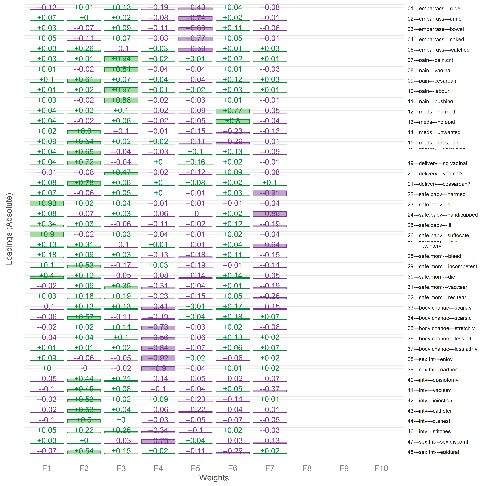

# Title

<!-- These two chunks should be added in the beginning of every .Rmd that you want to source an .R script -->
<!--  The 1st mandatory chunck  -->
<!--  Set the working directory to the repository's base directory -->


<!--  The 2nd mandatory chunck  -->
<!-- Set the report-wide options, and point to the external code file. -->


<!-- Load 'sourced' R files.  Suppress the output when loading packages. --> 


<!-- Load the sources.  Suppress the output when loading sources. --> 


<!-- Load any Global functions and variables declared in the R file.  Suppress the output. --> 


<!-- Declare any global functions specific to a Rmd output.Suppress the output. --> 


<!-- Load the datasets.   -->


<!-- Inspect the datasets.   -->

```
 [1] "id"             "pregnant"       "marital"        "education"      "weeks_pregnant" "haskids"       
 [7] "foc_01"         "foc_02"         "foc_03"         "foc_04"         "foc_05"         "foc_06"        
[13] "foc_07"         "foc_08"         "foc_09"         "foc_10"         "foc_11"         "foc_12"        
[19] "foc_13"         "foc_14"         "foc_15"         "foc_16"         "foc_17"         "foc_18"        
[25] "foc_19"         "foc_20"         "foc_21"         "foc_22"         "foc_23"         "foc_24"        
[31] "foc_25"         "foc_26"         "foc_27"         "foc_28"         "foc_29"         "foc_30"        
[37] "foc_31"         "foc_32"         "foc_33"         "foc_34"         "foc_35"         "foc_36"        
[43] "foc_37"         "foc_38"         "foc_39"         "foc_40"         "foc_41"         "foc_42"        
[49] "foc_43"         "foc_44"         "foc_45"         "foc_46"         "foc_47"         "foc_48"        
[55] "foc_49"        
```

```
[1] "name"        "label"       "select"      "name_new"    "label_graph" "label_short" "domain"     
```

```
Observations: 643
Variables: 55
$ id             (dbl) 777640814, 777691683, 780115487, 790676990, 790727352, 791611897, 792537673, 794147752, 7943...
$ pregnant       (fctr) YES, YES, YES, YES, YES, YES, YES, YES, YES, YES, YES, YES, YES, YES, YES, YES, YES, YES, Y...
$ marital        (fctr) Single, Married, Cohabiting, Married, Cohabiting, Cohabiting, Married, Cohabiting, Married,...
$ education      (fctr) NA, NA, Masters, Masters, Completed high school, Partial university undergraduate degree, M...
$ weeks_pregnant (dbl) 15, 22, 12, 29, 29, 10, 13, 21, 35, 33, 23, 33, 28, 34, 37, 39, 34, 18, 7, 26, 22, 14, 18, 6...
$ haskids        (fctr) None, None, None, None, None, None, None, None, None, None, None, None, None, None, None, N...
$ foc_01         (fctr) Not at all, Not at all, Moderately, Not at all, Not at all, Moderately, Not at all, Not at ...
$ foc_02         (fctr) Not at all, Not at all, Very, Moderately, Not at all, Slightly, Slightly, Moderately, Not a...
$ foc_03         (fctr) Extremely, Not at all, Moderately, Very, Not at all, Moderately, Slightly, Moderately, Not ...
$ foc_04         (fctr) Not at all, Not at all, Slightly, Slightly, Not at all, Moderately, Not at all, Slightly, N...
$ foc_05         (fctr) Not at all, Slightly, Moderately, Slightly, Not at all, Moderately, Not at all, Not at all,...
$ foc_06         (fctr) Not at all, Not at all, Slightly, Not at all, Not at all, Slightly, Not at all, Extremely, ...
$ foc_07         (fctr) Very, Slightly, Moderately, Moderately, Slightly, Moderately, Slightly, Slightly, Slightly,...
$ foc_08         (fctr) Extremely, Slightly, Moderately, Moderately, Slightly, Moderately, Slightly, Not at all, Sl...
$ foc_09         (fctr) Not at all, Not at all, Extremely, Moderately, Not at all, Not at all, Not at all, Moderate...
$ foc_10         (fctr) Very, Slightly, Moderately, Moderately, Slightly, Moderately, Slightly, Slightly, Slightly,...
$ foc_11         (fctr) Extremely, Slightly, Moderately, Moderately, Slightly, Moderately, Slightly, Slightly, Slig...
$ foc_12         (fctr) Extremely, Not at all, Moderately, Not at all, Not at all, Slightly, Not at all, Not at all...
$ foc_13         (fctr) Not at all, Not at all, Not at all, Not at all, Not at all, Moderately, Not at all, Not at ...
$ foc_14         (fctr) Not at all, Not at all, Extremely, Slightly, Not at all, Slightly, Not at all, Extremely, N...
$ foc_15         (fctr) Not at all, Not at all, Extremely, Not at all, Not at all, Slightly, Not at all, Very, Mode...
$ foc_16         (fctr) Not at all, Not at all, Not at all, Not at all, Not at all, Not at all, Not at all, Not at ...
$ foc_17         (fctr) Moderately, Slightly, Extremely, Not at all, Slightly, Slightly, Not at all, Extremely, Mod...
$ foc_18         (fctr) Not at all, Not at all, Not at all, Not at all, Not at all, Not at all, Not at all, Not at ...
$ foc_19         (fctr) Not at all, Slightly, Extremely, Slightly, Moderately, Slightly, Not at all, Extremely, Mod...
$ foc_20         (fctr) Moderately, Not at all, Not at all, Not at all, Not at all, Slightly, Slightly, Not at all,...
$ foc_21         (fctr) Not at all, Slightly, Extremely, Not at all, Not at all, Not at all, Slightly, Extremely, E...
$ foc_22         (fctr) Slightly, Slightly, Moderately, Very, Extremely, Not at all, Not at all, Not at all, Modera...
$ foc_23         (fctr) Slightly, Slightly, Moderately, Very, Extremely, Not at all, Not at all, Slightly, Moderate...
$ foc_24         (fctr) Very, Slightly, Moderately, Very, Very, Not at all, Not at all, Not at all, Very, Extremely...
$ foc_25         (fctr) Moderately, Not at all, Moderately, Not at all, Very, Not at all, Not at all, Not at all, M...
$ foc_26         (fctr) Slightly, Slightly, Moderately, Very, Extremely, Not at all, Not at all, Not at all, Modera...
$ foc_27         (fctr) Slightly, Moderately, Moderately, Very, Extremely, Not at all, Not at all, Extremely, Moder...
$ foc_28         (fctr) Slightly, Not at all, Slightly, Slightly, Not at all, Slightly, Not at all, Not at all, Sli...
$ foc_29         (fctr) Slightly, Slightly, Moderately, Not at all, Not at all, Not at all, Not at all, Extremely, ...
$ foc_30         (fctr) Not at all, Not at all, Slightly, Not at all, Moderately, Not at all, Not at all, Not at al...
$ foc_31         (fctr) Moderately, Moderately, Moderately, Slightly, Not at all, Moderately, Not at all, Not at al...
$ foc_32         (fctr) Moderately, Moderately, Extremely, Moderately, Not at all, Slightly, Not at all, Moderately...
$ foc_33         (fctr) Not at all, Moderately, Not at all, Not at all, Not at all, Moderately, Not at all, Not at ...
$ foc_34         (fctr) Moderately, Slightly, Extremely, Not at all, Not at all, Not at all, Not at all, Moderately...
$ foc_35         (fctr) Moderately, Slightly, Moderately, Not at all, Not at all, Very, Not at all, Not at all, Not...
$ foc_36         (fctr) Slightly, Slightly, Moderately, Not at all, Not at all, Moderately, Not at all, Slightly, N...
$ foc_37         (fctr) Moderately, Not at all, Moderately, Not at all, Not at all, Very, Not at all, Not at all, S...
$ foc_38         (fctr) Slightly, Slightly, Moderately, Not at all, Not at all, Moderately, Not at all, Not at all,...
$ foc_39         (fctr) Moderately, Not at all, Moderately, Not at all, Not at all, Very, Not at all, Not at all, S...
$ foc_40         (fctr) Not at all, Moderately, Very, Very, Not at all, Slightly, Not at all, Very, Not at all, Ver...
$ foc_41         (fctr) Moderately, Moderately, Extremely, Moderately, Not at all, Slightly, Not at all, Extremely,...
$ foc_42         (fctr) Slightly, Very, Moderately, Not at all, Not at all, Not at all, Slightly, Extremely, Not at...
$ foc_43         (fctr) Slightly, Slightly, Moderately, Very, Not at all, Not at all, Slightly, Very, Not at all, N...
$ foc_44         (fctr) Not at all, Slightly, Very, Very, Not at all, Very, Not at all, Extremely, Moderately, Not ...
$ foc_45         (fctr) Moderately, Slightly, Very, Slightly, Not at all, Slightly, Not at all, Very, Not at all, V...
$ foc_46         (fctr) Not at all, Moderately, Extremely, Slightly, Moderately, Not at all, Not at all, Slightly, ...
$ foc_47         (fctr) Slightly, Not at all, Moderately, Not at all, Not at all, Moderately, Not at all, Not at al...
$ foc_48         (fctr) Moderately, Very, Moderately, Extremely, Not at all, Very, Not at all, Extremely, Not at al...
$ foc_49         (fctr) Not at all, Slightly, Moderately, Very, Not at all, Not at all, Not at all, Not at all, Not...
```

```
[1] "Not at all" "Slightly"   "Moderately" "Very"       "Extremely" 
```

<!-- Tweak the datasets.   -->


Define the function to produce the correlation object

```r
make_cor <- function(ds,metaData,items){
  
  # d <- ds %>% dplyr::select(foc_01:foc_49)
  d <- ds %>% dplyr::select_(.dots=items)
  
  rownames <- metaData %>% 
    dplyr::filter(name_new %in% items) %>% 
    dplyr::mutate(name_ = paste0(gsub("foc_", "", items),"---",domain, "---", label_graph))
  # dplyr::mutate(name_ = paste0(gsub("foc_", "", vars_49),"-",domain, "-",label_graph))
  # dplyr::mutate(name_ = paste0(gsub("foc_", "", vars_49),"-",label_graph))
  rownames <- rownames[,"name_"]
  
  d <- sapply(d, as.numeric)
  cormat <- cor(d)
  colnames(cormat) <- rownames; rownames(cormat) <- rownames
  return(cormat)
}
```
 
Define the function to display the factor pattern matrix

```r
display_solution <- function(R,k, sample_size,rotation_){
  A <- stats::factanal(factors = k, covmat=R, rotation="none", control=list(rotate=list(normalize=TRUE)))
  L <- A$loadings
  if(rotation_=="oblimin"  ){rotation_string <- "(L, Tmat=diag(ncol(L)), gam=0,               normalize=FALSE, eps=1e-5, maxit=1000)"}
  if(rotation_=="quartimin"){rotation_string <- "(L, Tmat=diag(ncol(L)),                      normalize=FALSE, eps=1e-5, maxit=1000)"}
  if(rotation_=="targetT"  ){rotation_string <- "(L, Tmat=diag(ncol(L)),         Target=NULL, normalize=FALSE, eps=1e-5, maxit=1000)"}
  if(rotation_=="targetQ"  ){rotation_string <- "(L, Tmat=diag(ncol(L)),         Target=NULL, normalize=FALSE, eps=1e-5, maxit=1000)"}
  if(rotation_=="pstT"     ){rotation_string <- "(L, Tmat=diag(ncol(L)), W=NULL, Target=NULL, normalize=FALSE, eps=1e-5, maxit=1000)"}
  if(rotation_=="pstQ"     ){rotation_string <- "(L, Tmat=diag(ncol(L)), W=NULL, Target=NULL, normalize=FALSE, eps=1e-5, maxit=1000)"}
  if(rotation_=="oblimax"  ){rotation_string <- "(L, Tmat=diag(ncol(L)),                      normalize=FALSE, eps=1e-5, maxit=1000)"}
  if(rotation_=="entropy"  ){rotation_string <- "(L, Tmat=diag(ncol(L)),                      normalize=FALSE, eps=1e-5, maxit=1000)"}
  if(rotation_=="quartimax"){rotation_string <- "(L, Tmat=diag(ncol(L)),                      normalize=FALSE, eps=1e-5, maxit=1000)"}
  if(rotation_=="Varimax"  ){rotation_string <- "(L, Tmat=diag(ncol(L)),                      normalize=FALSE, eps=1e-5, maxit=1000)"}
  if(rotation_=="simplimax"){rotation_string <- "(L, Tmat=diag(ncol(L)),           k=nrow(L), normalize=FALSE, eps=1e-5, maxit=1000)"}
  if(rotation_=="bentlerT" ){rotation_string <- "(L, Tmat=diag(ncol(L)),                      normalize=FALSE, eps=1e-5, maxit=1000)"}
  if(rotation_=="bentlerQ" ){rotation_string <- "(L, Tmat=diag(ncol(L)),                      normalize=FALSE, eps=1e-5, maxit=1000)"}
  if(rotation_=="tandemI"  ){rotation_string <- "(L, Tmat=diag(ncol(L)),                      normalize=FALSE, eps=1e-5, maxit=1000)"}
  if(rotation_=="tandemII" ){rotation_string <- "(L, Tmat=diag(ncol(L)),                      normalize=FALSE, eps=1e-5, maxit=1000)"}
  if(rotation_=="geominT"  ){rotation_string <- "(L, Tmat=diag(ncol(L)),           delta=.01, normalize=FALSE, eps=1e-5, maxit=1000)"}
  if(rotation_=="geominQ"  ){rotation_string <- "(L, Tmat=diag(ncol(L)),           delta=.01, normalize=FALSE, eps=1e-5, maxit=1000)"}
  if(rotation_=="cfT"      ){rotation_string <- "(L, Tmat=diag(ncol(L)),             kappa=0, normalize=FALSE, eps=1e-5, maxit=1000)"}
  if(rotation_=="cfQ"      ){rotation_string <- "(L, Tmat=diag(ncol(L)),             kappa=0, normalize=FALSE, eps=1e-5, maxit=1000)"}
  if(rotation_=="infomaxT" ){rotation_string <- "L, Tmat=diag(ncol(L)),                       normalize=FALSE, eps=1e-5, maxit=1000)"}
  if(rotation_=="infomaxQ" ){rotation_string <- "(L, Tmat=diag(ncol(L)),                      normalize=FALSE, eps=1e-5, maxit=1000)"}
  if(rotation_=="mccammon" ){rotation_string <- "(L, Tmat=diag(ncol(L)),                      normalize=FALSE, eps=1e-5, maxit=1000)"}
  if(rotation_=="bifactorT"){rotation_string <- "(L, Tmat=diag(ncol(L)),                      normalize=FALSE, eps=1e-5, maxit=1000)"}
  if(rotation_=="bifactorQ"){rotation_string <- "(L, Tmat=diag(ncol(L)),                      normalize=FALSE, eps=1e-5, maxit=1000)"}
  
  rotated_solution <- eval(parse(text=paste0(rotation_,rotation_string)))  
  p <- nrow(R)
  
  FPM <- rotated_solution$loadings # FPM - Factor Pattern Matrix
  FPM <- cbind(FPM, matrix(numeric(0), p, p-k)) # appends empty columns to have p columns
  colnames(FPM) <- paste0("F", 1:p) # renames for better presentation in tables and graphs
  FPM  # THE OUTPUT
  Phi <- rotated_solution$Phi # factor correlation matrix
  if( is.null(Phi)) {Phi <- diag(k)} else{Phi}
  colnames(Phi) <- paste0("F", 1:k)
  rownames(Phi) <- paste0("F", 1:k)    
  Phi
  solution <- list("FPM"=FPM,"Phi"=Phi)
  # load the function to gread the graph, needs k value
  source("./scripts/factor-pattern-plot.R") # to graph factor patterns
  g <- fpmFunction(FPM.matrix=solution$FPM, mainTitle=NULL) #Call/execute the function defined above.
  # print(g) #Print graph with factor pattern
  file_name <- paste0("./data/shared/derived/FPM/",rotation_,"_",k,".csv")
  #browser()
  save_file <- as.data.frame(FPM[,1:k])
  readr::write_csv(save_file,file_name)
  
  return(g)
}
```

# Phase 0 solution

```r
items_phase_0 <- c(paste0("foc_0",1:9), paste0("foc_",10:49))
R0 <- make_cor(ds, metaData, items_phase_0)
saveRDS(R0,"./data/shared/derived/R0.rds") 

# Phase_0 <- ds
items_0 <- R0
n.items_0 <- sample_size
p.items_0 <- nrow(R0)

# --- eigen-analysis ---------------------------------
R <- cor(R0) # correlation matrix R of variables in foc
eigen <- eigen(R) # eigen decomposition of R      #  VDV' : $values -eigenvalues, $vectors
svd <- svd(R)   # single value decomposition of R #  UDV' : $d      -eigenvalues, $u,$v
```


```r
R <- R1 # correlation matrix for items at phase 0
sample_size <- 643
for(solution_ in c("oblimin")){   # },"quartimin","geominQ","bifactorQ")){
# for(solution_ in c("oblimin","quartimin","geominQ","bifactorQ")){
  cat("\n\n")
  cat(paste0("## ",solution_)); 
  for(nfactors_ in c(7)){  
    cat("\n\n")
    cat(paste0("### ",nfactors_)); 
    cat("\n\n")
    solution <- display_solution(R,k=nfactors_,sample_size,solution_) %>%
      print()
    cat("\n\n")
    

  }  
}  
```


## oblimin

### 7

<!-- -->

