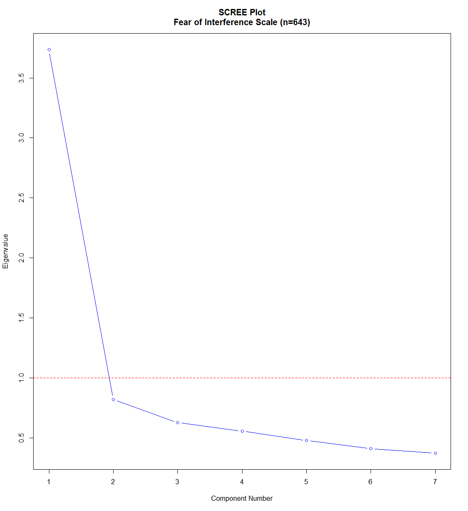
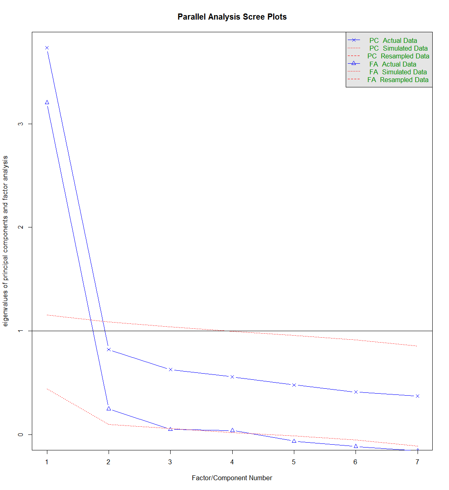

# Interference Scale

<!-- These two chunks should be added in the beginning of every .Rmd that you want to source an .R script -->
<!--  The 1st mandatory chunck  -->
<!--  Set the working directory to the repository's base directory -->


<!--  The 2nd mandatory chunck  -->
<!-- Set the report-wide options, and point to the external code file. -->


<!-- Load 'sourced' R files.  Suppress the output when loading packages. --> 


<!-- Load the sources.  Suppress the output when loading sources. --> 


<!-- Load any Global functions and variables declared in the R file.  Suppress the output. --> 


<!-- Declare any global functions specific to a Rmd output.Suppress the output. --> 


<!-- Load the datasets.   -->


Using 7 items of the Interference Scale
<!-- Inspect the datasets.   -->

```
  name_new                                                         label       label_graph
1    itf_1      Interference 1 - My relationship with my partner/spouse.  relations-spouse
2    itf_2         Interference 2 - My relationships with family members  relations-family
3    itf_3               Interference 3 - Other relationships in my life   relations-other
4    itf_4 Interference 4 - My relationships with my prenatal caregivers relations-parents
5    itf_5                                 Interference 5 - My work life         work-life
6    itf_6                        Interference 6 - My leisure activities           leisure
7    itf_7               Interference 7 - Getting ready for the new baby        baby-ready
```

```
            itf_1 itf_2 itf_3 itf_4 itf_5 itf_6 itf_7
Not at all    457   485   530   481   498   494   454
Slightly      113   106    82    93    92    93   128
Moderately     49    28    21    45    30    35    38
Quite a bit    15    20     6    20    16    18    19
Extremely       9     4     4     4     7     3     4
```


 


```r
Scree.Plot(Ritf,main="SCREE Plot\nFear of Interference Scale (n=643)")
```

<!-- -->


```r
library(psych)
itf <- ds %>% dplyr::select_(.dots = items_int)
itf <- matrix(as.numeric(unlist(itf)), nrow=nrow(itf), ncol=ncol(itf)) # turn it into a matrix

pa_result <- psych::fa.parallel(
  itf, 
  fm = "uls",
  fa = "both",
  se.bars = TRUE
) 
```

<!-- -->

```
Parallel analysis suggests that the number of factors =  2  and the number of components =  1 
```


