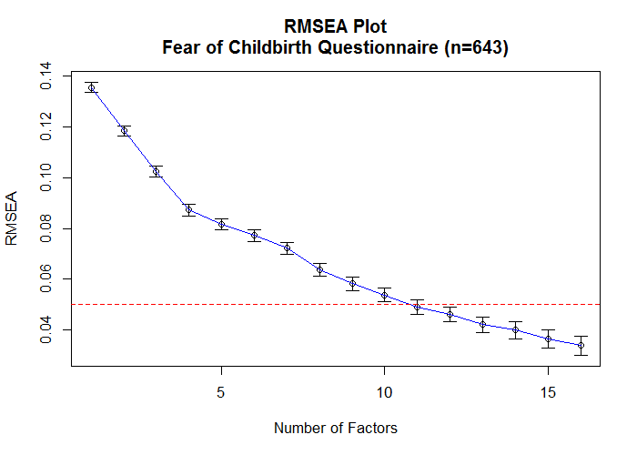
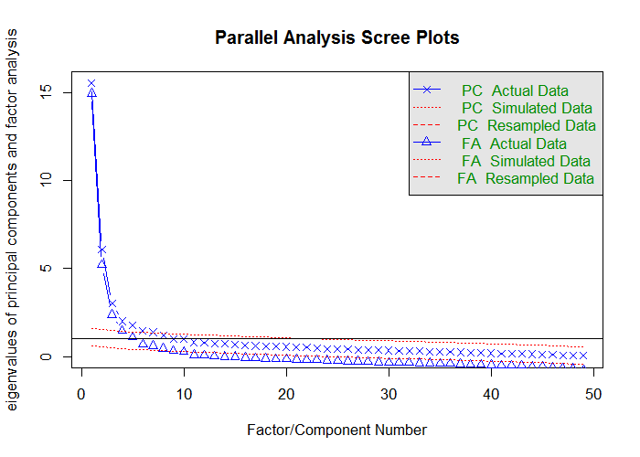
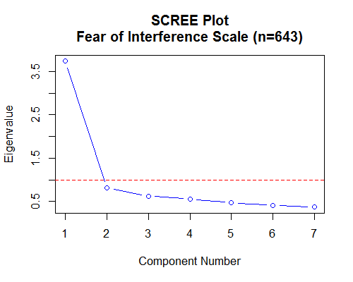
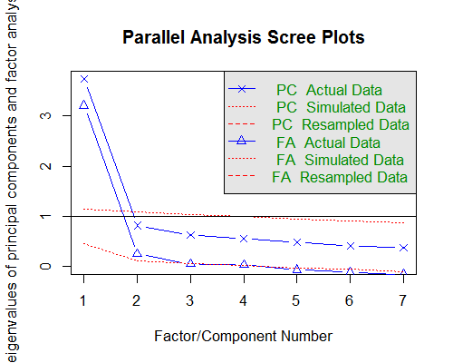

# Revision comments

<!-- These two chunks should be added in the beginning of every .Rmd that you want to source an .R script -->
<!--  The 1st mandatory chunck  -->
<!--  Set the working directory to the repository's base directory -->


<!--  The 2nd mandatory chunck  -->
<!-- Set the report-wide options, and point to the external code file. -->


<!-- Load 'sourced' R files.  Suppress the output when loading packages. --> 

```
Warning: package 'plotrix' was built under R version 3.2.5
```

```
Warning: package 'sem' was built under R version 3.2.5
```

<!-- Load the sources.  Suppress the output when loading sources. --> 


<!-- Load any Global functions and variables declared in the R file.  Suppress the output. --> 


<!-- Declare any global functions specific to a Rmd output.Suppress the output. --> 


<!-- Load the datasets.   -->


<!-- Inspect the datasets.   -->


<!-- Tweak the datasets.   -->


# Revision comments

## 1. Fit statistics.

> 3.	SPSS does not provide fit statistics for exploratory factor analysis. In order to convince me of the structure of your measure, you have to provide fit statistics. For example, M plus provides fit statistics for such analyses (also see reviewer 3; and M plus will provide geomin rotation), besides chi-squared, RMSEA (and confidence interval), also report at least CFI and TLI.

Response:

Here are the fit statistics for factor analytic solution in table and graphic format. 



```
      Factors Cum.Eigen Chi-Square   Df p.value   RMSEA.Pt   RMSEA.Lo   RMSEA.Hi
 [1,]       1  15.54644  14390.417 1127       0 0.13539363 0.13342391 0.13737263
 [2,]       2  21.61655  10789.396 1079       0 0.11839687 0.11637184 0.12043263
 [3,]       3  24.63805   7965.640 1032       0 0.10229945 0.10021106 0.10440020
 [4,]       4  26.64605   5796.907  986       0 0.08717812 0.08501450 0.08935580
 [5,]       5  28.41399   4959.072  941       0 0.08155423 0.07932515 0.08379840
 [6,]       6  29.87331   4332.693  897       0 0.07724020 0.07494366 0.07955277
 [7,]       7  31.25113   3712.555  854       0 0.07220659 0.06983360 0.07459650
 [8,]       8  32.46623   2923.307  812       0 0.06364000 0.06116116 0.06613606
 [9,]       9  33.47568   2448.905  771       0 0.05822225 0.05563812 0.06082320
[10,]      10  34.47393   2092.926  731       0 0.05387044 0.05117417 0.05658229
[11,]      11  35.28305   1766.844  692       0 0.04918721 0.04635593 0.05203071
[12,]      12  36.07588   1549.766  654       0 0.04618925 0.04322740 0.04915953
[13,]      13  36.82597   1318.401  617       0 0.04207975 0.03894254 0.04521586
[14,]      14  37.54288   1176.173  581       0 0.03994533 0.03665421 0.04322725
[15,]      15  38.21977   1014.674  546       0 0.03656552 0.03305376 0.04004819
[16,]      16  38.85704    891.419  512       0 0.03397481 0.03023079 0.03766446
```

## 2. Number of factors

> Using the standard scree plot is an outdated approach to select the number of factors. So please follow his advice and apply a more advanced method such as parallel analysis or the MAP test or if you use a scree plot, do this on basis of fit statistics like for example the Hull method described by Lorenzo-Seva, Timmerman and Kiers (2011).

### PA with `psych`

Using `psych` package conduct Parallel analysis

```r
library(psych)
foc <- ds %>% dplyr::select_(.dots = items_phase_0)
foc <- matrix(as.numeric(unlist(foc)), nrow=nrow(foc), ncol=ncol(foc)) # turn it into a matrix

pa_result <- psych::fa.parallel(
  foc, 
  fm = "uls",
  fa = "both",
  se.bars = TRUE
) # "Parallel analysis suggests that the number of factors =  9" (from "psych" package)
```



```
Parallel analysis suggests that the number of factors =  9  and the number of components =  7 
```


### Velicer's MAP Test


```

Velicer's Minimum Average Partial Test 


 The entered data is a correlation matrix.


Eigenvalues:

 root  eigenvalue
    1    15.54644
    2     6.07010
    3     3.02150
    4     2.00800
    5     1.76794
    6     1.45933
    7     1.37782
    8     1.21510
    9     1.00945
   10     0.99825
   11     0.80912
   12     0.79283
   13     0.75008
   14     0.71691
   15     0.67689
   16     0.63728
   17     0.60318
   18     0.58449
   19     0.55647
   20     0.54794
   21     0.53050
   22     0.51603
   23     0.48164
   24     0.43361
   25     0.42004
   26     0.40015
   27     0.38280
   28     0.37340
   29     0.35209
   30     0.34443
   31     0.33339
   32     0.32565
   33     0.30469
   34     0.27707
   35     0.27190
   36     0.24842
   37     0.23798
   38     0.22132
   39     0.19746
   40     0.18598
   41     0.17356
   42     0.15938
   43     0.14708
   44     0.13535
   45     0.12146
   46     0.10595
   47     0.06085
   48     0.05601
   49     0.05266


Velicer's Average Squared Correlations

 root   Avg.Corr.Sq.   Avg.Corr.power4
    0        0.11078           0.02640
    1        0.03678           0.00709
    2        0.02336           0.00437
    3        0.01848           0.00250
    4        0.01474           0.00127
    5        0.01357           0.00105
    6        0.01327           0.00097
    7        0.01291           0.00087
    8        0.01257           0.00074
    9        0.01220           0.00079
   10        0.01229           0.00077
   11        0.01292           0.00081
   12        0.01351           0.00086
   13        0.01427           0.00092
   14        0.01496           0.00103
   15        0.01573           0.00124
   16        0.01659           0.00151
   17        0.01814           0.00190
   18        0.01931           0.00235
   19        0.02064           0.00256
   20        0.02222           0.00308
   21        0.02393           0.00350
   22        0.02606           0.00402
   23        0.02870           0.00458
   24        0.03110           0.00517
   25        0.03513           0.00637
   26        0.03846           0.00762
   27        0.04089           0.00885
   28        0.04423           0.01004
   29        0.04756           0.01121
   30        0.05378           0.01316
   31        0.05752           0.01474
   32        0.06685           0.01793
   33        0.06915           0.01924
   34        0.07595           0.02189
   35        0.08841           0.02843
   36        0.09652           0.03152
   37        0.11042           0.03773
   38        0.12215           0.04425
   39        0.14644           0.05905
   40        0.15439           0.06775
   41        0.18216           0.08709
   42        0.19538           0.09707
   43        0.22050           0.10756
   44        0.24770           0.12921
   45        0.36678           0.22800
   46        0.34261           0.20812
   47        0.50826           0.38111
   48        1.00000           1.00000


The smallest average squared correlation is       0.0122

The smallest average 4rth power correlation is    0.00074

The Number of Factors According to the Original (1976) MAP Test is =   9

The Number of Factors According to the Revised  (2000) MAP Test is =   8 
```


## 3. PA of Interference Scale

Using 7 items of the Interference Scale
<!-- Inspect the datasets.   -->

```
  name_new                                                         label       label_graph
1    itf_1      Interference 1 - My relationship with my partner/spouse.  relations-spouse
2    itf_2         Interference 2 - My relationships with family members  relations-family
3    itf_3               Interference 3 - Other relationships in my life   relations-other
4    itf_4 Interference 4 - My relationships with my prenatal caregivers relations-parents
5    itf_5                                 Interference 5 - My work life         work-life
6    itf_6                        Interference 6 - My leisure activities           leisure
7    itf_7               Interference 7 - Getting ready for the new baby        baby-ready
```

```
            itf_1 itf_2 itf_3 itf_4 itf_5 itf_6 itf_7
Not at all    457   485   530   481   498   494   454
Slightly      113   106    82    93    92    93   128
Moderately     49    28    21    45    30    35    38
Quite a bit    15    20     6    20    16    18    19
Extremely       9     4     4     4     7     3     4
```


 


```r
Scree.Plot(Ritf,main="SCREE Plot\nFear of Interference Scale (n=643)")
```




```r
library(psych)
itf <- ds %>% dplyr::select_(.dots = items_int)
itf <- matrix(as.numeric(unlist(itf)), nrow=nrow(itf), ncol=ncol(itf)) # turn it into a matrix

pa_result <- psych::fa.parallel(
  itf, 
  fm = "uls",
  fa = "both",
  se.bars = TRUE
) 
```



```
Parallel analysis suggests that the number of factors =  2  and the number of components =  1 
```

